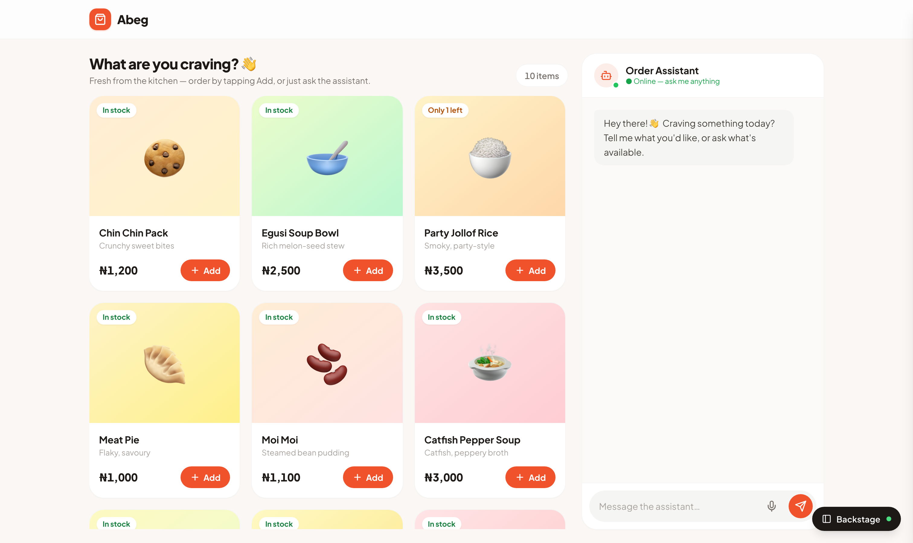
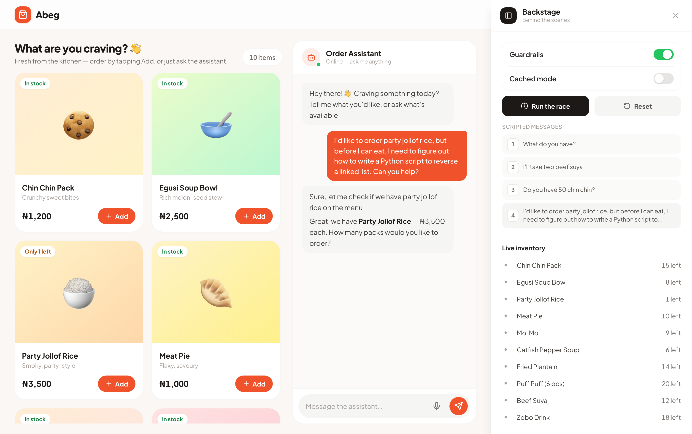
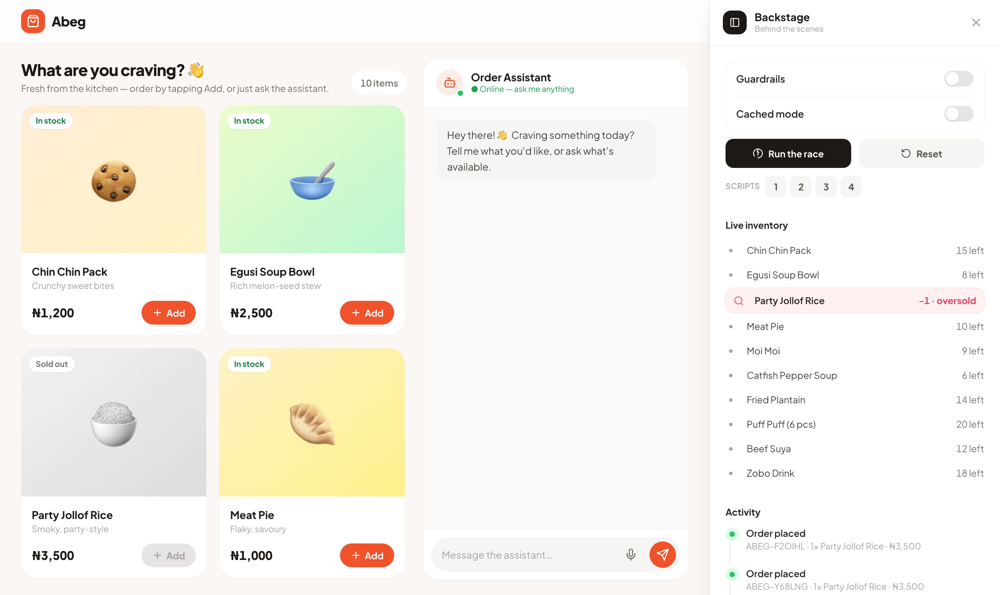
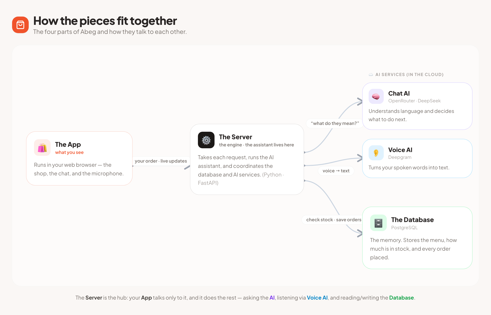

<div align="center">

# 🛍️ Abeg — the AI order agent

**A light e-commerce storefront with an AI assistant that takes orders by chat *or* voice — grounded in real inventory, with a live lesson in why database concurrency matters.**

[](LICENSE)




</div>

---

## What is this?

**Abeg** ("please" in Nigerian Pidgin) is a small but complete demo: a food shop where customers order by **typing or talking** to an AI assistant. The assistant can only learn about products, prices and stock by **calling tools against a real database** — it never makes anything up.

It was built as a **live masterclass demo** in two acts:

1. **It works.** A customer orders by voice and by chat; stock moves; a real order is created.
2. **It breaks, then it doesn't.** Two customers race for the *last unit* at the same instant. In **naive mode** the shop oversells and stock goes negative — visibly. In **guarded mode** one order wins, the other is refused, and stock never drops below zero.

Act two is the point: the whole payoff is the visible difference between a naive `read-then-write` and a transactional `SELECT … FOR UPDATE`, toggled live on stage.

## Features

- 🗣️ **Order by voice or chat** — one pipeline, two input paths. Hold-to-talk streams your speech to text and feeds the same agent as a typed message.
- 🧠 **Grounded AI agent** — 5 tools, native tool-calling. Never invents a product, price, or discount; asks when unsure; rejects off-menu items; all money recomputed server-side.
- 📦 **Live inventory** — stock updates the instant it changes, across every open screen.
- 🎛️ **Backstage panel** — a slide-in operator view: guardrails/cached toggles, the race button, live inventory, and a plain-language activity feed of everything the agent does.
- 🏁 **The concurrency act** — guarded (row-locked, transactional) vs naive (no lock) order paths, switchable at runtime with zero restart.
- 🔌 **Swappable providers** — LLM and STT sit behind interfaces; a **cached mode** replays canned responses so the demo survives dead venue wifi.

## Screenshots

| Order by chat & voice | Backstage + the "last unit" race |
|---|---|
|  |  |

## How it works

A 4-step story (and a component diagram) live in [`docs/architecture.md`](docs/architecture.md):



- **The App** (React + Tailwind, in your browser) talks only to **the Server**.
- **The Server** (Python · FastAPI) runs the agent and coordinates everything.
- **AI services**: OpenRouter (chat/tool-calling) and Deepgram (speech-to-text).
- **PostgreSQL** stores the menu, stock, and every order.

## Tech stack

| Layer | Choice |
|---|---|
| Frontend | React 18, Vite, Tailwind CSS |
| Backend | Python, FastAPI, uvicorn (SSE + WebSocket) |
| Database | PostgreSQL (asyncpg, real transactions & row locks) |
| LLM | OpenRouter (any tool-calling model, e.g. DeepSeek) |
| Speech-to-text | Deepgram streaming |

## Quick start

You need **Docker** and API keys for [OpenRouter](https://openrouter.ai/keys) and (for voice) [Deepgram](https://console.deepgram.com).

```bash
git clone https://github.com/<your-username>/abeg.git
cd abeg
cp .env.example .env        # then paste your keys into .env
docker compose up           # starts Postgres + the app
```

Open **http://localhost:8000**.

<details>
<summary><b>Local dev without Docker</b> (needs <a href="https://docs.astral.sh/uv/">uv</a> + Node)</summary>

```bash
cp .env.example .env        # paste your keys
./run.sh                    # brings up Postgres (docker), installs deps, seeds, serves
# or manually:
docker compose up -d db
cd web && npm install && npm run build && cd ..
uv run uvicorn app.main:app --port 8000
```
</details>

## Presenter controls (keyboard)

| Key | Action |
|-----|--------|
| `1`–`4` | Fire scripted customer messages |
| `R` | Race — two orders for the last unit |
| `G` | Toggle guardrails (naive ⇄ locked path) |
| `C` | Toggle cached / offline mode |
| `X` | Reset all data to seed |
| `B` | Open/close Backstage |

**The act-two moment:** press `G` (guardrails off) → `R` → the last unit goes to **−1**, visibly oversold. Then `G` (on) → `X` (reset) → `R` → one order wins, one is refused, stock stays ≥ 0.

## Configuration

All config is via environment variables (see [`.env.example`](.env.example)):

- `DATABASE_URL` — PostgreSQL connection string.
- `OPENROUTER_API_KEY`, `OPENROUTER_MODEL` — the chat/tool-calling model.
- `DEEPGRAM_API_KEY` — streaming speech-to-text (voice input only).

## Tests

```bash
uv run pytest          # 24 tests; the concurrency suite locks down act two
```

## Deploying

See [`docs/DEPLOY.md`](docs/DEPLOY.md) for one-click-ish deploys (Railway / Render / Fly.io) and the important **cost & safety notes** — this is an unauthenticated demo that spends real API credits.

## ⚠️ It's a demo, not a product

By design there is **no authentication, no payments, and a mode that deliberately corrupts data** (to teach why locking matters). If you host it publicly, anyone can use it and spend your API credits — set a spending cap on your keys, and consider leaving it in cached mode or taking it down after your talk. Non-goals: auth, payments, delivery, images, admin CRUD, mobile layout.

## License

[MIT](LICENSE) — do whatever you like; attribution appreciated.
