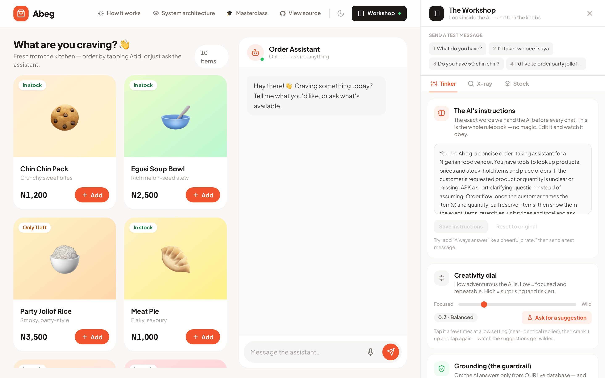
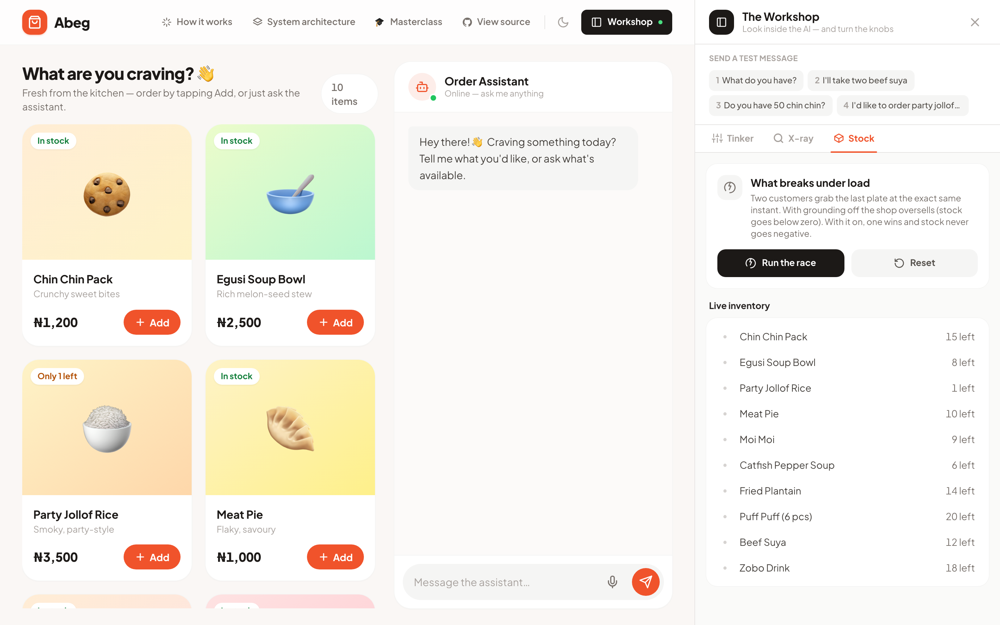
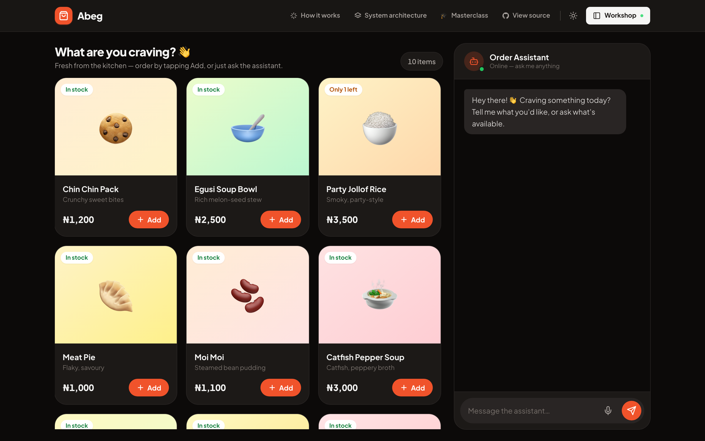
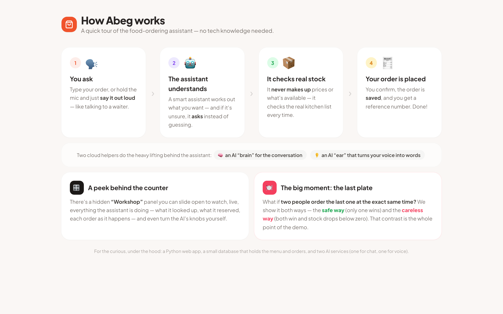

<div align="center">

# 🛍️ Abeg — the AI order agent

**A warm little food shop where customers order by chat *or* voice — and a hands-on lesson in the two guardrails every real AI product needs: don't make things up, and don't get talked into someone else's job.**

[](https://abeg.ifeolulesi.com)
[](LICENSE)


### ▶ **Try it live: [abeg.ifeolulesi.com](https://abeg.ifeolulesi.com)**


</div>

---

## What is this?

**Abeg** ("please" in Nigerian Pidgin) is a small but complete demo: a food shop where customers order by **typing or talking** to an AI assistant. The assistant can only learn about products, prices and stock by **calling tools against a real database** — it never makes anything up.

It was built as the live demo for the **Break Into AI Engineering** masterclass, to make three ideas you can *feel* instead of just hear about:

1. **A grounded agent works.** A customer orders by voice and by chat; stock moves; a real order is created — every price and quantity pulled from Postgres.
2. **Guardrails are the job.** Flip a switch and watch the AI **hallucinate a price** or get **prompt-injected into writing code** — then flip it back and watch it hold the line. (More below.)
3. **Systems still bite.** Two customers race for the *last plate* at the same instant: in naive mode the shop oversells and stock goes negative; in guarded mode one order wins, the other is refused, and stock never drops below zero.

Everything runs on real infrastructure — no mocks — and you can poke at all of it live from **the Workshop**.

## 🎛️ The Workshop — turn the knobs, watch the AI react

Open the **Workshop** (top-right, or press `B`) and you're looking at what an AI engineer actually controls — each with plain-language help and a one-tap **"Try it"**:



- **🧠 The AI's instructions** — the *actual* system prompt, live-editable. Edit it, send a message, watch behaviour change.
- **🎯 Creativity dial** — temperature, from Focused to Wild.
- **🛡️ Grounding** — on: the AI answers only from the live database and refuses to speculate; **off: it happily makes up a price.** The single most important lesson, as a toggle.
- **🎯 Stay on task** — prompt-injection defense (see below).
- **🔀 The brain** — swap the underlying model (DeepSeek / GPT-4o-mini / Claude Haiku) and watch cost & latency move.
- **🔑 Bring your own key** — paste your own OpenRouter key; your chats run on your account and skip the demo's limit.

And the **X-ray** tab replays every turn in plain language — *you said → the AI decided to use a tool → the database answered → it replied* — with the **real tokens, latency and cost** from that turn. No JSON. That's "what happens inside AI engineering," made visible.

## The two guardrails every AI product needs

This is the heart of the demo — inspired by the viral moment when a customer talked a fast-food chain's AI into writing them a Python script instead of taking their order.

| Guardrail | Off (the failure) | On (the fix) |
|---|---|---|
| **🛡️ Grounding** | Invents a plausible price from memory | Refuses to speculate; looks it up in the database |
| **🎯 Stay on task** | Gets **prompt-injected** — writes your linked-list code | Politely declines and steers back to ordering |

Both are real: a firm prompt clause **plus** an output-side backstop that catches a slipped answer even if the model caves — and the X-ray shows a *"🛡 blocked"* chip when a guardrail fires. Tap **script #4** ("order jollof, then ask it to reverse a linked list") with **Stay on task** off, watch it get hijacked, then flip it on and watch it hold.

## The concurrency act



Press `R` to send two orders for the *last plate* at the same instant. With **Grounding off** (naive `read-then-write`) the shop oversells and stock goes to **−1**, visibly. Flip it **on** (transactional `SELECT … FOR UPDATE`) and one order wins, the other is refused, and stock never drops below zero. Same app, one toggle — that contrast is the whole lesson.

## Features at a glance

- 🗣️ **Order by voice or chat** — one agent pipeline, two input paths (hold-to-talk streams speech to text).
- 🧠 **Grounded agent** — 5 tools, native tool-calling; all money recomputed server-side.
- 🎛️ **The Workshop** — live, explained controls for prompt, temperature, grounding, on-task, model, and BYOK.
- 🔍 **X-ray** — plain-language turn trace with real tokens / latency / cost.
- 🌙 **Light & dark mode** — warm by day, warm by night; respects your OS.
- 🏁 **Concurrency demo** — guarded vs naive order paths, switchable live.
- 💸 **Cost-safe by design** — per-IP + daily **rate limits**, **BYOK**, and a graceful "AI is catching its breath" message when a key is throttled.
- 🔌 **Swappable providers** + a **cached mode** so a dead venue wifi can't kill the demo.

## Screenshots

| Dark mode | The beginner "how it works" |
|---|---|
|  |  |

## How it works

A plain-language walkthrough and a system diagram open **inside the app** ("How it works" / "System architecture" in the header), and live in [`docs/architecture.md`](docs/architecture.md):


- **The App** (React + TypeScript + Tailwind, in your browser) talks only to **the Server**.
- **The Server** (Python · FastAPI) runs the agent and coordinates everything over SSE + WebSockets.
- **AI services**: OpenRouter (chat / tool-calling) and Deepgram (speech-to-text).
- **PostgreSQL** stores the menu, stock, and every order — with real transactions and row locks.

## Tech stack

| Layer | Choice |
|---|---|
| Frontend | React 18, **TypeScript**, Vite, Tailwind CSS |
| Backend | Python, FastAPI, uvicorn (SSE + WebSocket) |
| Database | PostgreSQL (asyncpg, real transactions & row locks) |
| LLM | OpenRouter (any tool-calling model, e.g. DeepSeek) |
| Speech-to-text | Deepgram streaming |

## Quick start

You need **Docker** and API keys for [OpenRouter](https://openrouter.ai/keys) and (for voice) [Deepgram](https://console.deepgram.com).

```bash
git clone https://github.com/IfeOlulesi/abeg-app.git
cd abeg-app
cp .env.example .env        # then paste your keys into .env
docker compose up           # starts Postgres + the app
```

Open **http://localhost:8000**.

<details>
<summary><b>Local dev without Docker</b> (needs <a href="https://docs.astral.sh/uv/">uv</a> + Node)</summary>

```bash
cp .env.example .env        # paste your keys
./run.sh                    # brings up Postgres (docker), installs deps, seeds, serves
# or manually:
docker compose up -d db
cd web && npm install && npm run build && cd ..
uv run uvicorn app.main:app --port 8000
```
</details>

## Presenter controls (keyboard)

| Key | Action |
|-----|--------|
| `1`–`4` | Fire scripted customer messages (`4` = the prompt-injection one) |
| `R` | Race — two orders for the last unit |
| `G` | Toggle **Grounding** (naive ⇄ locked path) |
| `O` | Toggle **Stay on task** (prompt-injection defense) |
| `C` | Toggle cached / offline mode |
| `X` | Reset all data to seed |
| `B` | Open / close the Workshop |

**The act-two moment:** `G` (grounding off) → `R` → the last unit goes to **−1**, oversold. Then `G` (on) → `X` (reset) → `R` → one order wins, one is refused, stock stays ≥ 0.

## Configuration

All config is via environment variables (see [`.env.example`](.env.example)):

- `DATABASE_URL` — PostgreSQL connection string.
- `OPENROUTER_API_KEY`, `OPENROUTER_MODEL` — the chat / tool-calling model.
- `DEEPGRAM_API_KEY` — streaming speech-to-text (voice input only).
- `APP_URL` — public URL, sent to OpenRouter as the app referer.
- **Rate limits** (protect your credits on a public deploy): `RATE_LIMIT_ENABLED`, `CHAT_IP_LIMIT`, `CHAT_DAILY_LIMIT`, `STT_IP_LIMIT`, `STT_DAILY_LIMIT`.

Visitors can also **bring their own OpenRouter key** in the Workshop — it's stored only in their browser, sent per-request, never persisted, and bypasses the demo rate limit.

## Tests

```bash
uv run pytest          # 31 tests; the concurrency suite locks down the race,
                       # plus grounding, on-task, and rate-limit guards
```

## Deploying

See [`docs/DEPLOY.md`](docs/DEPLOY.md) for container deploys (Railway / Render / Fly.io), custom domains, and the important **cost & safety notes** — this is an unauthenticated demo that spends real API credits.

## ⚠️ It's a demo, not a product

By design there is **no authentication, no payments, and a mode that deliberately corrupts data** (to teach why locking matters). If you host it publicly, set a **spending cap** on your OpenRouter key (and top up credit to raise the rate-limit ceiling), keep the built-in rate limits on, and let visitors BYOK. Non-goals: auth, payments, delivery, images, admin CRUD, mobile layout.

## 🎓 From the masterclass

Abeg is the live demo from the **Break Into AI Engineering** masterclass. Want the full recording — how it's built, why grounding and on-task guardrails matter, and how to think like an AI engineer?

### 👉 **Get the recording: [selar.com/38531854y1](https://selar.com/38531854y1)**

## License

[MIT](LICENSE) — do whatever you like; attribution appreciated.
</content>
