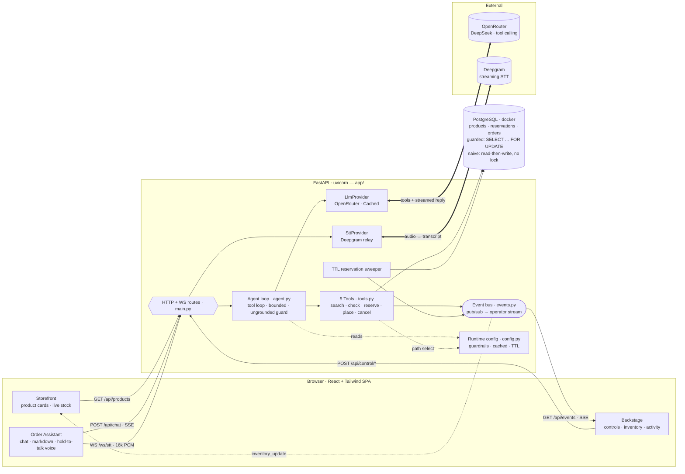

# Abeg — Architecture

> **Showing this to a non-technical / beginner audience?** Use the plain-language
> explainer at `static/architecture.html`
> (`http://localhost:8000/static/architecture.html`) — a 4-step "how it works" story
> with no jargon. The diagram below is the **technical** view, for engineers.

Voice/chat AI ordering grounded in real inventory, with a live guarded-vs-naive
concurrency demo. FastAPI serves the built React SPA and exposes the API/WS/SSE
surface; the agent talks to OpenRouter (LLM tool calling) and Deepgram (STT), and
all state lives in PostgreSQL.

## Two key flows

**1. Order (chat or voice).** Browser → `POST /api/chat` (SSE) — or `WS /ws/stt`
→ Deepgram → transcript → the same chat pipeline. The agent loop calls OpenRouter
with the 5 tool schemas; tools read/write PostgreSQL (money recomputed from the DB,
unknown SKUs rejected) and emit events onto the bus. Assistant tokens stream back
over the chat SSE; every tool call/result + inventory change streams to the operator
via `GET /api/events` and renders in Backstage.

**2. The concurrency act.** `POST /api/control/race` fires two concurrent orders for
the last unit. The **guardrails** toggle (`config.py`) selects the DB path in
`tools.py`: **guarded** = one transaction with `SELECT … FOR UPDATE` + idempotency
(one succeeds, one refused, stock never below zero); **naive** = read-then-write with
no lock (both succeed, stock goes negative — visibly). A TTL sweeper expires stale
reservations and returns their stock.
